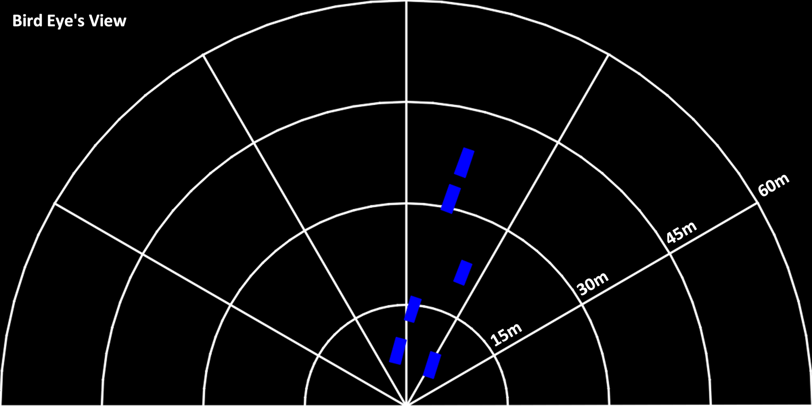
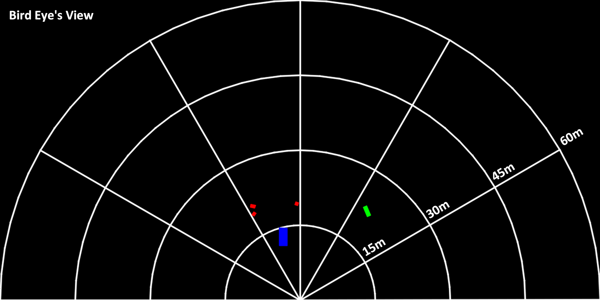
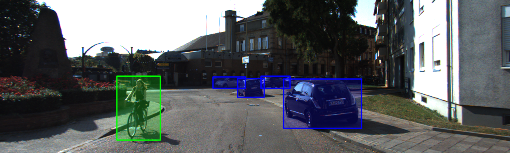
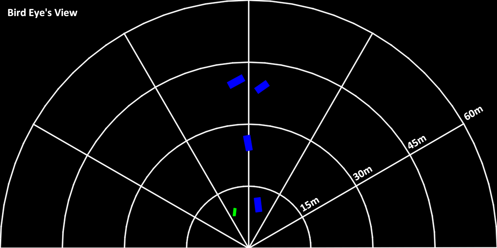

# MonoCon (AAAI, 2022)
This repository contains unofficial pytorch implementation for **[MonoCon: Learning Auxiliary Monocular Contexts Helps Monocular 3D Object Detection (AAAI, 2022)](https://arxiv.org/abs/2112.04628)**.   
We have removed the dependency on [mmdetection3d](https://github.com/open-mmlab/mmdetection3d) from the original author's [code](https://github.com/Xianpeng919/MonoCon).


## Features
Unchecked items are currently being prepared.
- [x] Single-GPU Training
- [x] KITTI Evaluation
- [ ] Multi-GPU Training
- [x] Visualization (2D Bounding Box + Projected 3D Bounding Box)
- [x] Visualization (Bird Eye's View)


## Preparations

### Setup
```bash
# [Step 1]: Create new conda environment and activate.
#           Set [ENV_NAME] freely to any name you want. (Please exclude the brackets.)
conda create --name [ENV_NAME] python=3.8
conda activate [ENV_NAME]

# [Step 2]: Clone this repository and change directory.
git clone https://github.com/2gunsu/monocon-pytorch
cd monocon-pytorch

# [Step 3]: See https://pytorch.org/get-started/locally/ and install pytorch for your environment.
#           We have tested on version 1.11.0.

# [Step 4]: Install some packages using 'requirements.txt' in the repository.
pip install -r requirements.txt
```

### Environments
We have tested our code in the following environment.  
Since the RTX A6000 does not support CUDA 10 version, we could not confirm the operation in CUDA 10 or lower environments.
| OS                 | Python       | Pytorch      | CUDA         | GPU                   | NVIDIA Driver |
| :----------------: | :----------: | :----------: | :----------: | :-------------------: | :-----------: |
| Ubuntu 18.04.5 LTS | 3.8.13       | 1.11.0       | 11.4         | NVIDIA RTX A6000      | 470.129.06    |


## Dataset
### KITTI 3D Object Detection Dataset
Please download **KITTI dataset** from [here](http://www.cvlibs.net/datasets/kitti/eval_object.php?obj_benchmark=3d).  
Click the three items below from the link to download it and unzip it into the same folder.
- Download left color images of object data set (12 GB)
- Download camera calibration matrices of object data set (16 MB)
- Download training labels of object data set (5 MB)

The structure of the data files should be as below.
```bash
[ROOT]
│
├── training
│   ├── calib
│   │   ├── 000000.txt
│   │   ├── 000001.txt
│   │   └── ...
│   ├── image_2
│   │   ├── 000000.png
│   │   ├── 000001.png
│   │   └── ...
│   └── label_2
│       ├── 000000.txt
│       ├── 000001.txt
│       └── ...
│
└── testing
    ├── calib
    ├── image_2
    └── label_2
```


## Usage
### Training
Just edit the items in ```config/monocon_configs.py``` before execution.
```bash
python train.py
```

### Evaluation
```bash
python test.py  --config_file       [FILL]  # Config file (.yaml file)
                --checkpoint_file   [FILL]  # Checkpoint file (.pth file)
                --evaluate                  # Perform evaluation (Quantitative Results)
```

### Inference
```bash
python test.py  --config_file       [FILL]  # Config file (.yaml file)
                --checkpoint_file   [FILL]  # Checkpoint file (.pth file)
                --visualize                 # Perform visualization (Qualitative Results)
                --save_dir          [FILL]  # Path where visualization results will be saved to
```


## Quantitative Results

### 3D Metric on Car Class
|           | AP40@Easy     | AP40@Mod.     | AP40@Hard     |
| --------- | ---------     |-----------    |-----------    |
| Official  | 26.33         | 19.03         | 16.00         |
| This Repo | 26.03 (-0.30) | 19.02 (-0.01) | 15.92 (-0.08) | 

### BEV Metric on Car Class
|           | AP40@Easy     | AP40@Mod.     | AP40@Hard     |
| --------- | ---------     |-----------    |-----------    |
| Official  | 34.65         | 25.39         | 21.93         |
| This Repo | 35.98 (+1.33) | 26.01 (+0.62) | 22.41 (+0.48) |

You can download the weight file and config file for the above pretrained model [here](https://drive.google.com/drive/folders/1yVgt8cU-aHtoteATha_7_2U4TxseSrBX?usp=sharing).  
Change the value of ```DATA.ROOT``` in the ```config.yaml``` file to the KITTI data path.  

Depending on the starting seed, the above performance may not be reproduced.  
The table below shows the performance obtained through 5 independent training, and it can be seen that there is some performance deviation.   
|               | AP40@Easy     | AP40@Mod.     | AP40@Hard     |
| ---------     | ---------     |-----------    |-----------    |
| Train #1      | 26.03         | 19.02         | 15.92         |
| Train #2      | 25.50         | 18.40         | 15.47         |
| Train #3      | 23.61         | 16.85         | 14.79         |
| Train #4      | 23.40         | 17.36         | 14.69         |
| Train #5      | 24.29         | 17.95         | 15.32         |
| **Mean**      | 24.57         | 17.92         | 15.24         |
| **Std**       | 1.16          | 0.85          | 0.51          |


## Qualitative Results  
Visualizations for 2D Boxes, 3D Boxes, and BEV, respectively, from top to bottom for each sample.  
- **000008.png** (Validation Set)  

  
  

- **000134.png** (Validation Set)  

  
  

- **000472.png** (Validation Set)  

  
  

- **004122.png** (Validation Set)  

  
  


## Change Log

### v1.0.0 (2022.08.28)
- This repository is released.

### v1.0.1 (2022.08.29)
- Visualization functions for 2D Boxes and 3D Boxes have been added.


## Citation
```latex
@InProceedings{liu2022monocon,
    title={Learning Auxiliary Monocular Contexts Helps Monocular 3D Object Detection},
    author={Xianpeng Liu, Nan Xue, Tianfu Wu},
    booktitle = {36th AAAI Conference on Artifical Intelligence (AAAI)},
    month = {Feburary},
    year = {2022}
}
```


## References
The following repositories were referred.  
- [MonoCon](https://github.com/Xianpeng919/MonoCon)
- [mmdetection3d](https://github.com/open-mmlab/mmdetection3d)
- [nuScenes-devkit](https://github.com/nutonomy/nuscenes-devkit)